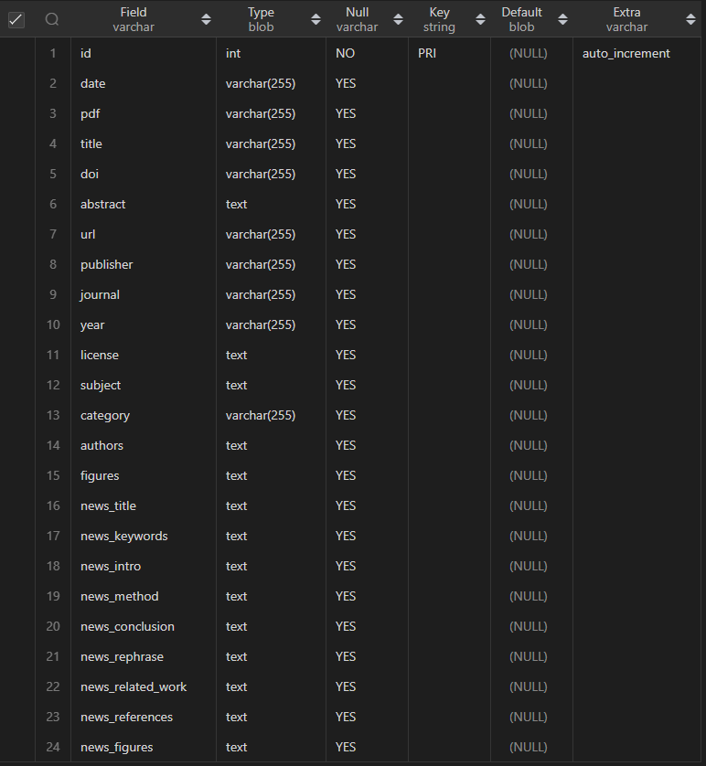

# Auto Generation

This repo aims to store scripts that will auto-execute to generate news structured data from specified folders to specified persistent database(MySQL).

## How to use

First, you should create your `mysql` database with specific structure which is described in the end.

Copy `config.ini_example` to `config.ini` and populate it.

Execute the code following to install dependencies

```python
pip install ./requirements.txt
```

Create a folder to store papers crawlered every day. And name it in `YYMMDD` format.

Run the `main.py` file to generate yesterday `YYMMDD` format news and store the datas in database configurated in configurated frequence.

## Database structure

Structure is following

This is `news` table.



This is `news_logs` table.


